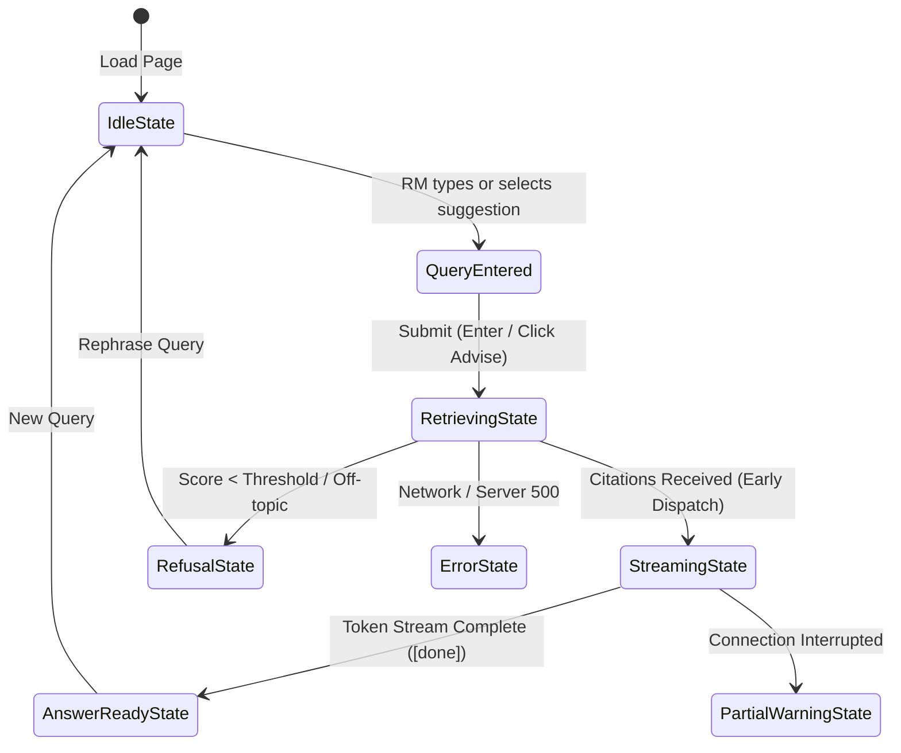

# UX Design & Wireframe Specification (Mock UX)
## WealthConnect — Relationship Manager Advisory Terminal

**Document Purpose**: Validates the end-to-end user experience, wireframes, interaction flows, and edge cases for Relationship Managers (RMs) and Wealth Administrators before frontend code integration.  
**Milestone**: 3.9 Mock UX  
**Application**: WealthConnect Grounded RAG Assistant  

---

## 1. Design Principles & Goals

1. **Grounded First, Fast Second**: Every factual statement is highlighted with an interactive citation badge `[1]`, `[2]`. The source document, section, and text must be accessible in a single click.
2. **Zero Ambiguity on Refusal**: If evidence is missing or off-topic, the interface communicates an explicit refusal banner instead of a misleading guess.
3. **Executive Banking Aesthetics**: Premium dark-slate palette with emerald accents (representing wealth & verification), crisp typography, glassmorphism cards, and low-latency streaming animations.
4. **Actionable Administration**: Simple modal to upload new policy circulars and monitor active knowledge base health.

---

## 2. Desktop Advisory Console Wireframe

```text
+-------------------------------------------------------------------------------------------------------+
|  [Logo] WealthConnect Advisory Portal     (Model: gpt-4o-mini | KB: 16 Chunks | Cache: 100% | Latency: 12ms) |
+-------------------------------------------------------------------------------------------------------+
|                                                                                                       |
|  [H1] Approved Wealth Advisory Assistant                                                              |
|  Grounded answers based strictly on active investment policies, tax circulars, and brochures.         |
|                                                                                                       |
|  +-------------------------------------------------------------------------------------------------+  |
|  |  Ask a wealth advisory question (e.g. "What is the tax exemption limit for capital gains?")      |  |
|  +-------------------------------------------------------------------------------------------------+  |
|  [ Mode: [x] Stream Tokens  [ ] Batch Response ]   [ Clear History ]             [ Search / Advise ]  |
|                                                                                                       |
|  Suggested Prompts:                                                                                   |
|  [ Capital Gains Tax Rules ]  [ Q4 Portfolio Return ]  [ Moderate Growth Fund ]  [ Password Reset ]   |
|                                                                                                       |
|  +-------------------------------------------------------------------------------------------------+  |
|  |  STATUS: Grounded answer ready (Verified from 2 approved sources)                    [Copy Answer] |
|  |-------------------------------------------------------------------------------------------------|  |
|  |  ANSWER:                                                                                        |  |
|  |  Long-term capital gains up to $50,000 on approved clean energy and municipal bond investments   |  |
|  |  are exempt from federal wealth surtax under Section 12-B [1]. For corporate accounts, the      |  |
|  |  standard 15% rate applies with no threshold relief [2].                                        |  |
|  |                                                                                                 |  |
|  |  ---------------------------------------------------------------------------------------------  |  |
|  |  VERIFIED SOURCES (2 Retrieved Chunks):                                                         |  |
|  |                                                                                                 |  |
|  |  [+] [1] sample_tax_rules.md  |  Section: Capital Gains Exemptions  |  Relevance: 0.942           |  |
|  |      "Long-term capital gains up to $50,000 on approved clean energy and municipal bond..."     |  |
|  |                                                                                                 |  |
|  |  [+] [2] sample_tax_rules.md  |  Section: Corporate Account Surtaxes |  Relevance: 0.887          |  |
|  |      "Corporate wealth accounts are subject to a flat 15% assessment with no threshold..."       |  |
|  +-------------------------------------------------------------------------------------------------+  |
|                                                                                                       |
|  +-------------------------------------------------------------------------------------------------+  |
|  |  [Admin Drawer Button] [+] Upload Approved Document (.pdf, .html, .md, .txt)                   |  |
|  +-------------------------------------------------------------------------------------------------+  |
+-------------------------------------------------------------------------------------------------------+
```

---

## 3. Interaction State Machine



---

## 4. Key UI Components & Specification

### 4.1 System Status Banner & Indicators
- **Dot Indicator**:
  - `Green Pulse`: Ready / Connected.
  - `Cyan Blink`: Retrieving / Streaming tokens in real-time.
  - `Amber`: Out of scope / Guardrail refusal triggered.
  - `Red`: Network or server failure.
- **Diagnostic Badges**: Shows active model (`gpt-4o-mini` or `offline-mock`), active collection (`wealthconnect_chunks`), and cache hit rate.

### 4.2 Citation Inspector Panel
- Each citation marker in text (`[1]`, `[2]`) is a clickable pill that jumps down to or expands the corresponding source card.
- **Card Contents**:
  - Document Title & Source Link (e.g. `sample_tax_rules.md`)
  - Section Heading (e.g. `Capital Gains Exemptions`)
  - Relevance Score (`0.942`)
  - Verbatim Text Snippet matching the retrieved chunk
  - Copy snippet button for RM compliance records

### 4.3 Refusal & Guardrail State
When an RM asks an out-of-scope query (e.g., *"What is the weather tomorrow in Paris?"* or a query with zero vocabulary overlap):
- **Refusal Header**: `⚠ Advisory Guardrail Triggered`
- **Explanation**: *"I could not find sufficient approved context in the Wealth Knowledge Base to answer that question. In accordance with bank compliance policy, unverified answers cannot be provided."*
- **Escalation Button**: `[Contact Wealth Compliance Desk]` or `[Submit Document Request]`

### 4.4 Admin Document Upload Modal
- **Drag-and-Drop Zone**: Accepts `.txt`, `.md`, `.pdf`, `.html`.
- **Form Metadata**:
  - Document Type dropdown (`Investment Policy`, `Tax Rules`, `Product Brochure`, `Eligibility Guidelines`).
  - Approval Date and Version (`v1.0`, `v2.1`).
- **Live Progress**: `Extracting` $\rightarrow$ `Cleaning` $\rightarrow$ `Chunking` $\rightarrow$ `Embedding` $\rightarrow$ `Indexed (12 chunks)`.

---

## 5. Responsive Behavior & Accessibility (WCAG 2.1 AA)
- Mobile & Tablet view: Stack input and citations vertically.
- Keyboard navigation: Full Tab / Enter access to suggestions, citations, and modals.
- Screen readers: `aria-live="polite"` on streaming answer area and status bar.
