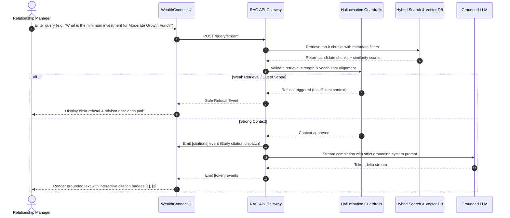

# Product Requirements Document (PRD)
## WealthConnect — Grounded Wealth Advisory Assistant

**Document Status**: Approved  
**Version**: 2.0  
**Target Milestone**: Sprint 2 RAG Application Final Delivery  
**Target Audience**: Relationship Managers (RMs), Wealth Management Leadership, Compliance & Audit Teams, Engineering

---

## 1. Executive Summary & Problem Statement

### 1.1 Problem Statement
> **A retail bank's wealth division stores investment policies, tax rules, and product brochures, but relationship managers give inconsistent advice because no tool grounds answers in the current approved material.**

In high-net-worth (HNW) and mass-affluent wealth management, accuracy is paramount. Inconsistent, outdated, or fabricated advice leads to regulatory sanctions, customer financial loss, and reputational damage. Relationship Managers (RMs) currently search through disparate file shares, outdated intranet portals, and multi-page PDF/HTML brochures, resulting in:
1. **Advisory Inconsistency**: Different RMs deliver conflicting interpretations of eligibility thresholds, fee structures, and tax rules.
2. **Slow Response Times**: Advisory consultations require manually cross-referencing multi-page product manuals, stalling client conversations.
3. **Compliance Risk**: Answers lack verifiable attribution to approved, currently effective policy versions.

### 1.2 Solution Overview
**WealthConnect** is an enterprise-grade Retrieval-Augmented Generation (RAG) assistant designed specifically for retail bank relationship managers. It intercepts natural-language advisory questions, semantically searches the repository of approved wealth documents, retrieves exact evidence chunks, enforces strict hallucination guardrails, and synthesizes answers with inline citations linked to source documents, sections, and chunk IDs.

---

## 2. Target Personas & User Journeys

### 2.1 Personas
| Persona | Role | Primary Goal | Pain Point |
|:---|:---|:---|:---|
| **P1: Relationship Manager (RM)** | Advises bank clients on portfolio allocations, investment products, and tax eligibility. | Instantly find approved, accurate guidance during or immediately before client calls. | Waste 15–20 minutes digging through 40+ page brochures; fear giving unverified advice. |
| **P2: Wealth Compliance Officer** | Audits advice given by RMs for regulatory and policy adherence. | Ensure every recommendation is 100% traceable to current, unexpired policies. | Difficult to reconstruct where an RM obtained specific tax or product claims. |
| **P3: Wealth Administrator** | Manages publication, versioning, and retirement of wealth documents. | Keep the knowledge base up-to-date with newly approved brochures and tax circulars. | Legacy systems require engineering redeployment to refresh document indices. |

### 2.2 Core User Journey (Relationship Manager)


---

## 3. Goals & Success Metrics

### 3.1 Business & Operational Goals
- **Consistency**: 100% of generated responses must cite approved bank documents.
- **Speed**: Reduce advisory document lookup time from ~15 minutes to < 2 seconds.
- **Self-Service Administration**: Allow Wealth Admins to upload and index newly approved circulars without downtime.

### 3.2 Key Performance Indicators (KPIs) & SLAs
| Metric | Definition | Target SLA |
|:---|:---|:---|
| **Grounding Fidelity** | % of factual claims supported directly by retrieved text | $\ge 98\%$ |
| **Citation Precision** | % of citations pointing to the exact source & chunk | $100\%$ |
| **Hallucination Rate** | Ungrounded claims or fabricated facts | $0.0\%$ (Refusal triggered on weak context) |
| **P95 Latency (Standard)** | Time to complete answer for `/query` | $< 2.0\text{ s}$ |
| **Time to First Token (TTFT)** | Latency for first streaming token on `/query/stream` | $< 350\text{ ms}$ |
| **Cache Hit Ratio** | % of identical / repeated queries served from cache | $\ge 40\%$ |

---

## 4. Functional Requirements

### 4.1 Ingestion & Document Processing (Milestones 3.3, 3.19–3.24)
- **FR-01 (Multi-Format Intake)**: Support `.txt`, `.md`, `.pdf`, and `.html` intake, preserving document names and section anchors.
- **FR-02 (Cleaning Pipeline)**: Strip boilerplate headers, footers, pagination ("Page X of Y"), and normalize whitespace/Unicode (NFKC).
- **FR-03 (Paragraph-Aware Chunking)**: Break documents along natural paragraph boundaries and token bounds to preserve semantic integrity of numbers and rules.
- **FR-04 (Metadata Tagging)**: Every chunk must record `document_name`, `document_type`, `version`, `approval_status`, `chunk_index`, and character bounds.
- **FR-05 (Completeness Reconciler)**: Verify all discovered files are either successfully indexed or flagged in the failure report.

### 4.2 Embeddings, Indexing & Hybrid Retrieval (Milestones 3.4, 3.5, 3.25–3.35)
- **FR-06 (Dense Embeddings)**: Vectorize chunks using 1536-dimensional embeddings with persistent indexing in ChromaDB and in-memory cosine fallback.
- **FR-07 (Metadata Filtering)**: Allow filtering by `approval_status: "approved"` and document categories (`investment_policy`, `tax_rules`, `product_brochure`, `eligibility_guidelines`).
- **FR-08 (Hybrid Search)**: Blend dense semantic cosine similarity with BM25 keyword matching using Reciprocal Rank Fusion (RRF).
- **FR-09 (Precision Re-Ranking)**: Re-score top candidates so the most directly relevant paragraphs appear first.

### 4.3 Grounded Generation & Guardrails (Milestones 3.6, 3.13, 3.37–3.43)
- **FR-10 (System/User Role Segregation)**: Enforce grounding via immutable system prompts (`prompts/system_prompt_strict.txt`).
- **FR-11 (Hallucination Guardrails & Refusal)**: Automatically refuse to answer if:
  - Top retrieval score falls below `MIN_TOP_SCORE` (default `0.06`).
  - Vocabulary overlap between query and retrieved context is zero (off-topic queries).
- **FR-12 (Source Citations)**: Format evidence with numbered markers `[1]`, `[2]`. Validate that every marker in the answer maps to a real retrieved chunk.
- **FR-13 (Conversational Follow-Ups)**: Maintain multi-turn chat history with token budget enforcement and query condensation for follow-up turns.

### 4.4 API & Runtime Administration (Milestones 3.44–3.48)
- **FR-14 (Unified REST & SSE API)**:
  - `POST /query`: Batch grounded answer with source metadata.
  - `POST /query/stream`: Server-Sent Events stream with early citation emit.
  - `POST /upload`: Runtime file upload that cleans, chunks, and indexes documents into the active collection.
  - `GET /health`: Health and collection diagnostics.
  - `GET /metrics`: Observability endpoint reporting queries, latency, and cache hit rate.
- **FR-15 (Query Caching & Audit Logging)**: In-memory LRU query cache with TTL; append-only audit log recording query, status, sources, and latency.

### 4.5 Relationship Manager Web UI (Milestones 3.46, 3.47)
- **FR-16 (Executive UI)**: Sleek, high-contrast banking dark theme with quick suggestions, streaming toggle, collapsible citation inspector, and admin upload modal.

---

## 5. Non-Functional & Security Requirements

1. **Security & Secrets**: Zero hardcoded credentials. All API keys and endpoints loaded via `.env` and `.env.example`.
2. **Offline Resiliency**: In the absence of an external API key or network, the entire RAG pipeline falls back to deterministic local mock vectors and offline grounded synthesis without throwing crashes.
3. **Auditability**: Every generated answer must produce an audit trail containing timestamp, query, retrieved chunk IDs, confidence scores, and user turn.
4. **Data Isolation**: Document stores and audit logs are separated from application code in `data/`, `outputs/`, and `logs/`.

---

## 6. Document Taxonomy & Metadata Schema

```json
{
  "document_name": "sample_tax_rules.md",
  "document_type": "tax_rules",
  "version": "1.0",
  "approval_status": "approved",
  "effective_date": "2024-01-01",
  "chunk_index": 2,
  "section": "Capital Gains Exemption",
  "char_start": 412,
  "char_end": 789
}
```

Approved Document Categories:
- `investment_policy`: Portfolio rules, asset allocation constraints, risk profiles.
- `tax_rules`: Capital gains, exemptions, tax loss harvesting guidelines.
- `product_brochure`: Features, yields, fee structures, redemption windows.
- `eligibility_guidelines`: Investor accreditation, net-worth criteria, residency checks.
